# UC1 Supply Chain Security Pipeline — Flow Diagrams

---

## Diagram 1 — Full Pipeline Overview (All Stages)

```mermaid
flowchart TD
    classDef stage    fill:#1e40af,stroke:#1e3a8a,color:#fff
    classDef output   fill:#065f46,stroke:#064e3b,color:#fff
    classDef decision fill:#92400e,stroke:#78350f,color:#fff
    classDef terminal fill:#1f2937,stroke:#374151,color:#fff
    classDef error    fill:#7f1d1d,stroke:#991b1b,color:#fff
    classDef api      fill:#4c1d95,stroke:#5b21b6,color:#fff

    START(["▶  START
    python run_pipeline.py github-url
    optional: --token  --out-dir  --e2e-repos"]):::terminal

    SETUP["⚙ Setup — Language Detection
    detect_language() probes GitHub raw API
    Returns: ecosystem + manifest content"]:::stage

    MFOUND{Manifest
    found?}:::decision

    ERR(["✗ Exit — no supported
    manifest at repo root"]):::error

    PARSE["Parse manifest by ecosystem
    java-maven → parse_pom + parse_pom_plugins
    python     → parse_requirements_txt / pyproject
    nodejs     → parse_package_json
    dotnet     → parse_csproj
    ruby       → parse_gemfile
    go         → parse_go_mod"]:::stage

    S1["Stage 1 — CVE Scan
    _osv_package_spec per dep
    Batch POST → api.osv.dev/v1/querybatch
    Fetch full detail per vuln ID
    Extract CVSS scores + CVE aliases"]:::stage
    O1[("dependency-check-report.json")]:::output

    S15["Stage 1.5 — SBOM Generation
    CycloneDX 1.5 JSON format
    pkg:ecosystem/group/artifact@version
    Machine-readable component inventory"]:::stage
    O15[("sbom-cyclonedx.json")]:::output

    S2["Stage 2 — Risk Scoring
    Composite score 0–100 per dep
    40% CVSS  30% business criticality
    20% exposure factor  10% maintenance risk
    Tiers: CRITICAL ≥80  HIGH ≥60  MEDIUM ≥40"]:::stage
    O2[("risk-scores.json")]:::output

    S3["Stage 3 — Supply-Chain Audit + License Check
    ① Untrusted source — group prefix list
    ② Typosquatting — name similarity patterns
    ③ Real license lookup per package registry
       lookup_license_for_dep → SPDX identifier
    Up to 30 deps checked for license violations"]:::stage
    O3[("audit-report.json")]:::output

    S35["Stage 3.5 — Secret Detection
    Regex scan all text files in output dir
    10+ patterns: AWS keys, GitHub PATs,
    DB passwords, JWT secrets, PEM keys
    Redacted output — raw secrets never stored"]:::stage
    O35[("secret-scan-report.json")]:::output

    S37["Stage 3.7 — Policy Enforcement
    Load policy.json if present in output dir
    P001 — max CVSS threshold        FAIL
    P002 — High CVE count limit      WARN
    P003 — blocked SPDX licenses     FAIL
    P006 — secrets severity gate     FAIL
    P007 — untrusted source count    WARN"]:::stage
    O37[("policy-report.json")]:::output

    S39["Stage 3.9 — Dependency Drift Detection
    Compare current deps vs saved baseline
    Classify each change:
    added / removed / upgraded
    downgraded / unchanged"]:::stage
    BL{Baseline
    exists?}:::decision
    INIT["Create initial baseline
    All deps recorded as INITIAL"]:::stage
    DIFF["Diff current vs previous
    Classify bump types per change"]:::stage
    O39[("drift-report.json
    dependency-baseline.json")]:::output

    S4["Stage 4 — Auto-Remediation
    Top 15 deps by composite risk score
    lookup_latest_version_ecosystem per registry
    Classify bump: PATCH / MINOR / MAJOR
    patch_manifest — ecosystem-aware patching
    find_existing_pr — idempotency check"]:::stage
    TK{GitHub
    token?}:::decision
    DRY["Dry-run mode
    Generate upgrade plan only
    Log what would happen"]:::stage
    LIVE["Live mode
    Create fix branch on GitHub
    Commit patched manifest
    Open or update consolidated PR"]:::stage
    O4[("remediation-manifest.json")]:::output

    S5["Stage 5 — PR Validation
    4 gates per upgrade
    See Diagram 3 for gate detail"]:::stage
    O5[("validation-report.json")]:::output

    S6["Stage 6 — E2E Stress Test
    Record wall-clock timing per stage
    Optionally run --e2e-repos in temp dirs
    Aggregate multi-repo results"]:::stage
    O6[("e2e-report.json")]:::output

    S7["Stage 7 — Audit Trail + Health Report
    Aggregate all 13 output files
    Health score 0–100 with letter grade A–F
    Generate GitHub Actions workflow YAML
    Deductions: –15 Critical, –8 High CVE
    Credits:    +10 per CVE fixed, +5 per PR merged"]:::stage
    O7A[("audit-trail.json")]:::output
    O7B[("dependency-health-report.html")]:::output
    O7C[("security-scan.yml")]:::output

    S7A["Stage 7a — Unit Tests
    Run test_pipeline.py as subprocess
    63 tests across 15 test classes
    _UC1_IMPORT_ONLY guard — no network calls"]:::stage
    O7D[("test-results.json")]:::output
    INJ["Inject results into HTML report
    Unit Test Results panel"]:::stage

    END(["✅  DONE
    Open dependency-health-report.html
    Copy security-scan.yml to .github/workflows/"]):::terminal

    %% ── Flow ──────────────────────────────────────────
    START  --> SETUP
    SETUP  --> MFOUND
    MFOUND -->|No| ERR
    MFOUND -->|Yes| PARSE
    PARSE  --> S1
    S1     --> O1
    O1     --> S15
    S15    --> O15
    O1     --> S2
    S2     --> O2
    O15    --> S3
    S3     --> O3
    O3     --> S35
    S35    --> O35
    O35    --> S37
    S37    --> O37
    O37    --> S39
    S39    --> BL
    BL     -->|No - first run| INIT
    BL     -->|Yes| DIFF
    INIT   --> O39
    DIFF   --> O39
    O39    --> S4
    O2     --> S4
    S4     --> TK
    TK     -->|No| DRY
    TK     -->|Yes| LIVE
    DRY    --> O4
    LIVE   --> O4
    O4     --> S5
    S5     --> O5
    O5     --> S6
    S6     --> O6
    O6     --> S7
    S7     --> O7A
    S7     --> O7B
    S7     --> O7C
    O7B    --> S7A
    S7A    --> O7D
    O7D    --> INJ
    INJ    --> END
```



---

## Diagram 2 — Language Detection Detail (Setup Stage)

```mermaid
flowchart TD
    classDef stage    fill:#1e40af,stroke:#1e3a8a,color:#fff
    classDef decision fill:#92400e,stroke:#78350f,color:#fff
    classDef output   fill:#065f46,stroke:#064e3b,color:#fff
    classDef api      fill:#4c1d95,stroke:#5b21b6,color:#fff
    classDef terminal fill:#1f2937,stroke:#374151,color:#fff
    classDef error    fill:#7f1d1d,stroke:#991b1b,color:#fff

    IN(["github-url provided"]):::terminal

    LOCAL{"Local manifest in
    output dir?"}:::decision

    PROBE["Probe GitHub raw content API
    raw.githubusercontent.com
    Try branches: HEAD → main → master → develop"]:::api

    P1{"pom.xml
    found?"}:::decision
    P2{"requirements.txt
    found?"}:::decision
    P3{"pyproject.toml
    found?"}:::decision
    P4{"package.json
    found?"}:::decision
    P5{"*.csproj
    found?"}:::decision
    P6{"Gemfile
    found?"}:::decision
    P7{"go.mod
    found?"}:::decision
    NONE(["✗ Exit — no manifest"]):::error

    EMVN["Ecosystem: java-maven
    Manifest: pom.xml"]:::stage
    EPY1["Ecosystem: python
    Manifest: requirements.txt"]:::stage
    EPY2["Ecosystem: python
    Manifest: pyproject.toml"]:::stage
    ENJ["Ecosystem: nodejs
    Manifest: package.json"]:::stage
    ECS["Ecosystem: dotnet
    Manifest: *.csproj"]:::stage
    ERB["Ecosystem: ruby
    Manifest: Gemfile"]:::stage
    EGO["Ecosystem: go
    Manifest: go.mod"]:::stage

    POM["parse_pom()
    Resolve property vars: ${log4j.version}
    Extract dependencies + versions
    Filter: compile/runtime scope only"]:::stage

    PLUG["parse_pom_plugins()
    Extract build/plugins section
    Append to all_deps list
    Maven plugins can carry CVEs"]:::stage

    PREQ["parse_requirements_txt()
    Parse: name==ver  name>=ver  name~=ver
    Compile-time deps only"]:::stage

    PPYP["parse_pyproject_toml()
    Read [project.dependencies] table"]:::stage

    PJS["parse_package_json()
    Read dependencies object
    Skip devDependencies"]:::stage

    PCS["parse_csproj()
    Read PackageReference elements
    Extract Version attribute"]:::stage

    PGF["parse_gemfile()
    Parse: gem 'name', 'version'"]:::stage

    PGO["parse_go_mod()
    Read require block
    Strip v prefix from versions"]:::stage

    DEPS(["all_deps list ready
    → proceed to Stage 1"]):::output

    IN --> LOCAL
    LOCAL -->|Yes - use local copy| EMVN
    LOCAL -->|No| PROBE
    PROBE --> P1
    P1 -->|Yes| EMVN
    P1 -->|No|  P2
    P2 -->|Yes| EPY1
    P2 -->|No|  P3
    P3 -->|Yes| EPY2
    P3 -->|No|  P4
    P4 -->|Yes| ENJ
    P4 -->|No|  P5
    P5 -->|Yes| ECS
    P5 -->|No|  P6
    P6 -->|Yes| ERB
    P6 -->|No|  P7
    P7 -->|Yes| EGO
    P7 -->|No|  NONE

    EMVN  --> POM
    POM   --> PLUG
    PLUG  --> DEPS
    EPY1  --> PREQ
    EPY2  --> PPYP
    ENJ   --> PJS
    ECS   --> PCS
    ERB   --> PGF
    EGO   --> PGO
    PREQ  --> DEPS
    PPYP  --> DEPS
    PJS   --> DEPS
    PCS   --> DEPS
    PGF   --> DEPS
    PGO   --> DEPS
```

---

## Diagram 3 — Stage 4: Auto-Remediation Detail

```mermaid
flowchart TD
    classDef stage    fill:#1e40af,stroke:#1e3a8a,color:#fff
    classDef decision fill:#92400e,stroke:#78350f,color:#fff
    classDef output   fill:#065f46,stroke:#064e3b,color:#fff
    classDef api      fill:#4c1d95,stroke:#5b21b6,color:#fff
    classDef terminal fill:#1f2937,stroke:#374151,color:#fff
    classDef warn     fill:#78350f,stroke:#92400e,color:#fff

    IN(["risk-scores.json + manifest ready"]):::terminal

    TOP15["Select top 15 deps
    sorted by composite risk score desc"]:::stage

    VER["lookup_latest_version_ecosystem(dep)
    Route by ecosystem:"]:::stage

    VMVN["Maven Central
    repo1.maven.org
    Filter out SNAPSHOT/alpha/beta/RC"]:::api
    VPYPI["PyPI
    pypi.org/pypi/name/json"]:::api
    VNPM["npm Registry
    registry.npmjs.org/name/latest"]:::api
    VNUGET["NuGet
    api.nuget.org flatcontainer index"]:::api
    VRUBY["RubyGems
    rubygems.org/api/v1/gems/name.json"]:::api
    VGO["Go Proxy
    proxy.golang.org/module/@latest"]:::api

    FOUND{"New version
    found?"}:::decision
    SKIP["Add to skipped list
    No stable release available"]:::stage

    BUMP["bump_type(old_ver, new_ver)
    Compare semantic version segments"]:::stage
    BTYPE{"Bump
    type?"}:::decision
    BPATCH["PATCH bump
    1.2.3 → 1.2.4
    Bug fixes only — lowest risk"]:::stage
    BMINOR["MINOR bump
    1.2.x → 1.3.x
    New features, backwards compatible"]:::stage
    BMAJOR["MAJOR bump
    1.x → 2.x
    Breaking changes possible
    Requires human review"]:::warn

    PATCH_M["patch_manifest(ecosystem, content, upgrades)
    Route by ecosystem:
    Maven  → patch version tag or property declaration
    PyPI   → patch == pin in requirements.txt
    npm    → patch version in dependencies object
    NuGet  → patch Version attribute on PackageReference
    Ruby   → patch gem version string in Gemfile
    Go     → patch version in require block"]:::stage

    TK{"GitHub
    token provided?"}:::decision

    DRY["Dry-run
    Write remediation-manifest.json
    Log: would create branch + PR"]:::stage

    IDEM["find_existing_pr()
    Check GitHub API for open PR
    from branch fix/security-consolidated-upgrades"]:::api

    EXISTS{"PR already
    open?"}:::decision

    COMMENT["Post updated analysis
    as comment on existing PR"]:::api

    BRANCH["Create branch
    fix/security-consolidated-upgrades
    Commit patched manifest file"]:::api

    PR["Open consolidated PR
    PR body includes:
    • Upgrade table (old→new, bump, CVEs fixed)
    • Full CVE details with CVSS scores
    • Breaking change warnings for MAJOR bumps
    • Review checklist for human approval"]:::api

    O4[("remediation-manifest.json
    pull_requests list
    skipped list")]:::output

    NEXT(["→ Stage 5 PR Validation"]):::terminal

    IN    --> TOP15
    TOP15 --> VER
    VER   --> VMVN & VPYPI & VNPM & VNUGET & VRUBY & VGO
    VMVN & VPYPI & VNPM & VNUGET & VRUBY & VGO --> FOUND
    FOUND -->|No|  SKIP
    FOUND -->|Yes| BUMP
    BUMP  --> BTYPE
    BTYPE -->|PATCH| BPATCH
    BTYPE -->|MINOR| BMINOR
    BTYPE -->|MAJOR| BMAJOR
    BPATCH & BMINOR & BMAJOR --> PATCH_M
    PATCH_M --> TK
    TK    -->|No| DRY
    TK    -->|Yes| IDEM
    IDEM  --> EXISTS
    EXISTS -->|Yes| COMMENT
    EXISTS -->|No|  BRANCH
    BRANCH --> PR
    DRY & COMMENT & PR --> O4
    SKIP --> O4
    O4    --> NEXT
```

---

## Diagram 4 — Stage 5: PR Validation Gates Detail

```mermaid
flowchart TD
    classDef stage    fill:#1e40af,stroke:#1e3a8a,color:#fff
    classDef decision fill:#92400e,stroke:#78350f,color:#fff
    classDef output   fill:#065f46,stroke:#064e3b,color:#fff
    classDef api      fill:#4c1d95,stroke:#5b21b6,color:#fff
    classDef terminal fill:#1f2937,stroke:#374151,color:#fff
    classDef pass     fill:#064e3b,stroke:#065f46,color:#fff
    classDef fail     fill:#7f1d1d,stroke:#991b1b,color:#fff
    classDef skip     fill:#374151,stroke:#4b5563,color:#fff

    IN(["remediation-manifest.json ready
    Iterate over each upgrade"]):::terminal

    G1T{"mvn available
    on PATH?"}:::decision
    G1RUN["Gate 1 — mvn test
    Clone PR branch via git
    Run: mvn test --batch-mode
    Parse Surefire output
    Timeout: 300s"]:::stage
    G1P["Gate 1: PASS
    Exit code 0
    0 failures, 0 errors"]:::pass
    G1F["Gate 1: FAIL
    Non-zero exit or
    test failures/errors"]:::fail
    G1S["Gate 1: SKIPPED
    mvn not on PATH
    Run via security-scan.yml CI"]:::skip

    G2RUN["Gate 2 — OWASP Re-scan
    Always runs — no tools required
    POST api.osv.dev/v1/query
    for each new version
    Diff: new IDs vs baseline IDs"]:::api
    G2P["Gate 2: PASS
    0 new Critical/High CVEs
    N CVEs resolved"]:::pass
    G2F["Gate 2: FAIL
    Upgrade introduces
    new Critical or High CVE"]:::fail

    G3T{"grype available
    on PATH?"}:::decision
    G3RUN["Gate 3 — Grype Scan
    Clone PR branch via git
    Run: grype dir:. --output json
    Parse Critical/High findings"]:::stage
    G3P["Gate 3: PASS
    No new Critical/High
    findings introduced"]:::pass
    G3F["Gate 3: FAIL
    New Critical or High
    Grype findings found"]:::fail
    G3S["Gate 3: SKIPPED
    grype not on PATH
    Run via security-scan.yml CI"]:::skip

    G4T{"mvn available
    on PATH?"}:::decision
    G4RUN["Gate 4 — JaCoCo Coverage
    Clone PR branch via git
    Run: mvn test jacoco:report
    Parse jacoco.xml LINE coverage %"]:::stage
    G4P["Gate 4: PASS
    Coverage ≥ policy threshold
    default: 80%"]:::pass
    G4F["Gate 4: FAIL
    Coverage below threshold"]:::fail
    G4S["Gate 4: SKIPPED
    mvn not on PATH
    Run via security-scan.yml CI"]:::skip

    AGG["Aggregate gate results
    per upgrade"]:::stage

    VER{"Verdict"}:::decision

    AM["AUTO_MERGE
    PATCH or MINOR bump
    All gates PASS or SKIPPED
    Merge PR automatically if token present"]:::pass

    PH["PENDING_HUMAN
    MAJOR bump
    All gates PASS or SKIPPED
    Leave PR open — needs human approval"]:::stage

    BLK["BLOCKED
    One or more gates FAILED
    Leave PR open
    Post failure details as PR comment"]:::fail

    O5[("validation-report.json
    summary: auto_merged / pending / blocked
    per-PR gate results")]:::output

    NEXT(["→ Stage 6 E2E Stress Test"]):::terminal

    IN   --> G1T
    G1T  -->|No|  G1S
    G1T  -->|Yes| G1RUN
    G1RUN -->|pass| G1P
    G1RUN -->|fail| G1F

    IN   --> G2RUN
    G2RUN -->|pass| G2P
    G2RUN -->|fail| G2F

    IN   --> G3T
    G3T  -->|No|  G3S
    G3T  -->|Yes| G3RUN
    G3RUN -->|pass| G3P
    G3RUN -->|fail| G3F

    IN   --> G4T
    G4T  -->|No|  G4S
    G4T  -->|Yes| G4RUN
    G4RUN -->|pass| G4P
    G4RUN -->|fail| G4F

    G1P & G1F & G1S --> AGG
    G2P & G2F       --> AGG
    G3P & G3F & G3S --> AGG
    G4P & G4F & G4S --> AGG

    AGG --> VER
    VER -->|"PATCH/MINOR + all PASS/SKIP"| AM
    VER -->|"MAJOR + all PASS/SKIP"| PH
    VER -->|"any FAIL"| BLK

    AM  --> O5
    PH  --> O5
    BLK --> O5
    O5  --> NEXT
```

---

## Stage Summary at a Glance

| Stage | Name | Input | Output file | External API |
| --- | --- | --- | --- | --- |
| Setup | Language Detection | GitHub URL | — | raw.githubusercontent.com |
| Stage 1 | CVE Scan | all_deps | dependency-check-report.json | api.osv.dev |
| Stage 1.5 | SBOM Generation | all_deps | sbom-cyclonedx.json | — |
| Stage 2 | Risk Scoring | CVE report | risk-scores.json | — |
| Stage 3 | Supply-Chain Audit | SBOM + deps | audit-report.json | registry per ecosystem |
| Stage 3.5 | Secret Detection | local text files | secret-scan-report.json | — |
| Stage 3.7 | Policy Enforcement | all reports | policy-report.json | — |
| Stage 3.9 | Drift Detection | deps + baseline | drift-report.json | — |
| Stage 4 | Auto-Remediation | risk scores | remediation-manifest.json | registry + api.github.com |
| Stage 5 | PR Validation | remediation manifest | validation-report.json | api.osv.dev + optional mvn/grype |
| Stage 6 | E2E Stress Test | all outputs | e2e-report.json | — |
| Stage 7 | Health Report | all 13 outputs | health-report.html + audit-trail.json + security-scan.yml | — |
| Stage 7a | Unit Tests | test_pipeline.py | test-results.json | — |
